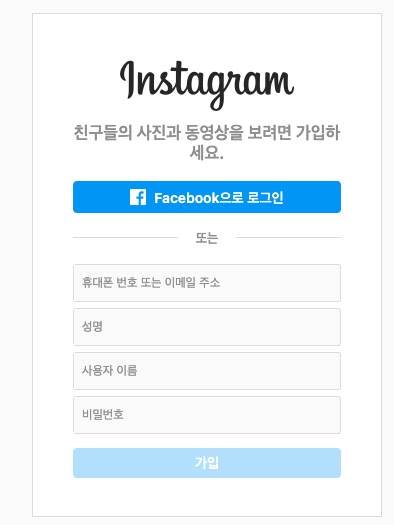
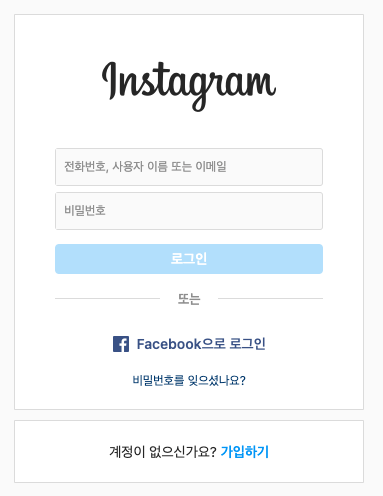
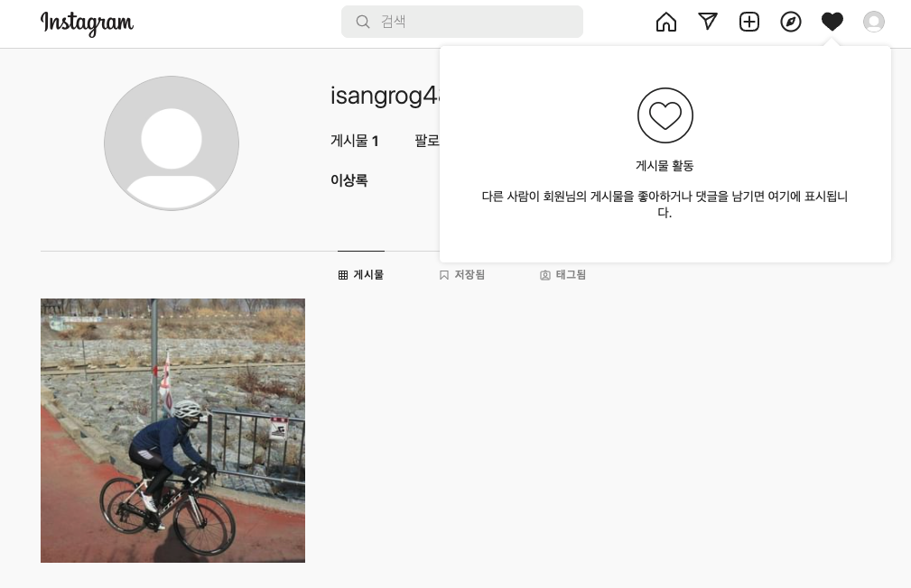
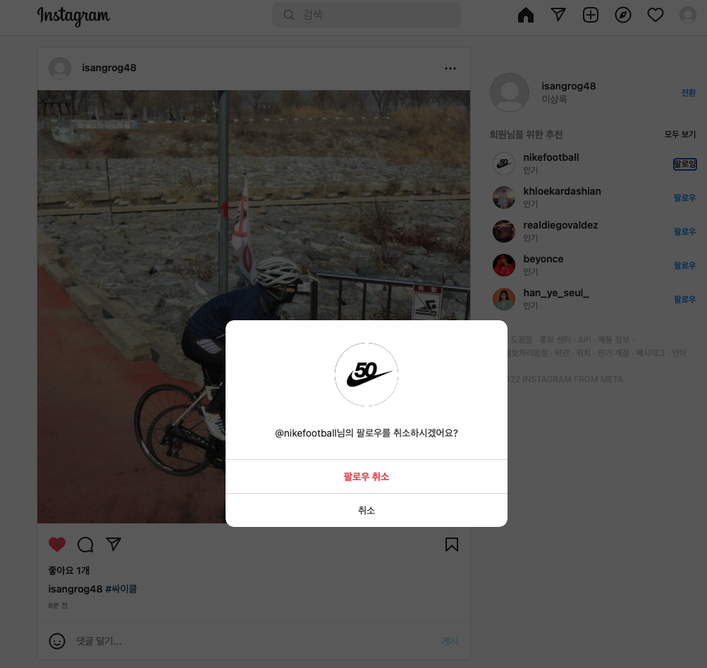

# 기획서

<aside>
💡 프로젝트명

 
</aside>

    - 인스타 클론 코딩 

<aside>
💡 기능

 
</aside>

1. 로그인 / 회원가입
    - 회원가입, 로그인, 로그아웃 기능 (JWT 사용)
    
2. 피드관련 사진 업로드 기능, 댓글, 좋아요, 더보기 모달 기능
    - 피드 사진 업로드
    - 댓글 달기
    - 좋아요 기능
    - 더보기 모달 기능
    
3. 마이페이지 게시물 , 게시물 활동
    - 게시물 피드
    - 게시물 활동 업데이트
    
4. 팔로잉 팔로워 기능 구현
    - 보유 팔로워 수 즉시 업데이트 기능
    - 보유 팔로잉 수 즉시 업데이트 기능
    - 팔로잉 신청 기능
    - 팔로잉 알람 기능
    - 팔로우 취소 기능
    - 함께 팔로잉 하는 사람 추천 기능

---

<aside>
💡 와이어프레임

 
</aside>

### 회원가입 / 로그인

### 피드관련 사진 업로드

**추가 기능 구현 사항**

1. 프로필 편집 기능 

2. 북마크 기능

3. 게시글 과 Feed 부분 화면 스크롤 끝까지 내렸을때 추가 피드 불러오는 페이지네이션 기능 

4. DM기능

5. 검색(해시태그, user)
